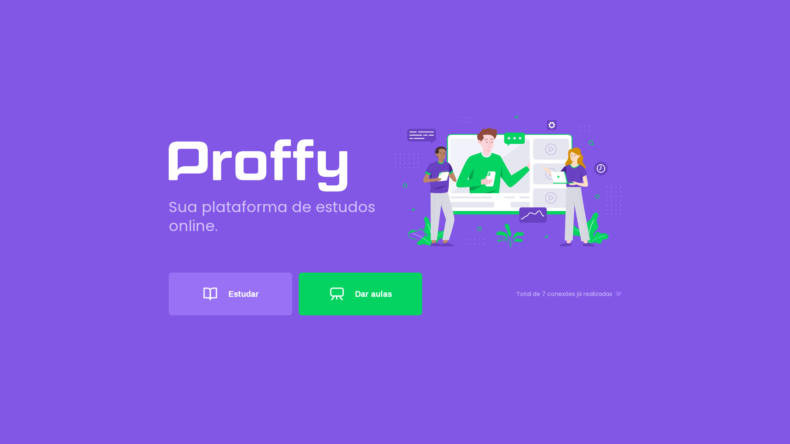

# Next Level Week #2

<h1 align='center'>
  
</h1>

## Project

The project is a platform to connect people and teachers *online*.

## Techs

It was built with the following techs:

- [Node.js](https://nodejs.org/en/)
- [React](https://reactjs.org)
- [React Native](https://facebook.github.io/react-native/)
- [Expo](https://expo.io/)
- [Typescript](https://www.typescriptlang.org/)

## License

The project is under MIT License. See the 
[LICENSE](LICENSE.md) file for more details.