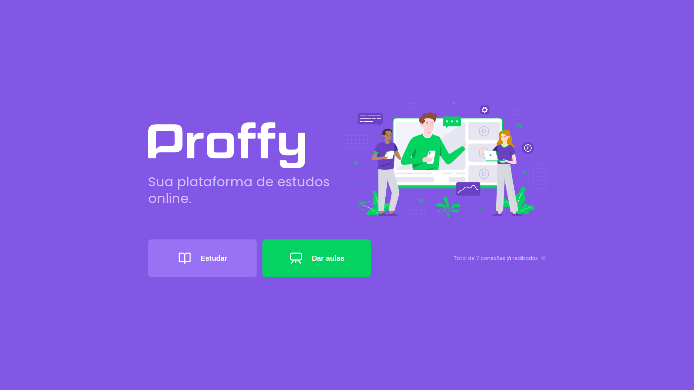
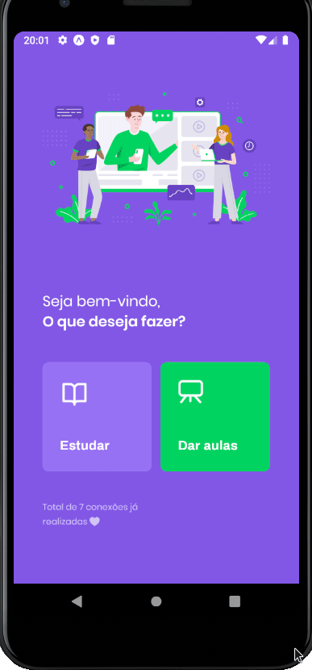

# Next Level Week #2

<h1 align='center'>
  
</h1>

## Projeto

O projeto é uma plataforma para conectar pessoas e professores *online*.

## Tecnologias

Este projeto foi desenvolvido com as seguintes tecnologias:

- [Node.js](https://nodejs.org/en/)
- [React](https://reactjs.org)
- [React Native](https://facebook.github.io/react-native/)
- [Expo](https://expo.io/)
- [Typescript](https://www.typescriptlang.org/)

## Licença

O projeto está sob a licença MIT. Veja o arquivo [LICENSE](LICENSE.md) para mais detalhes.